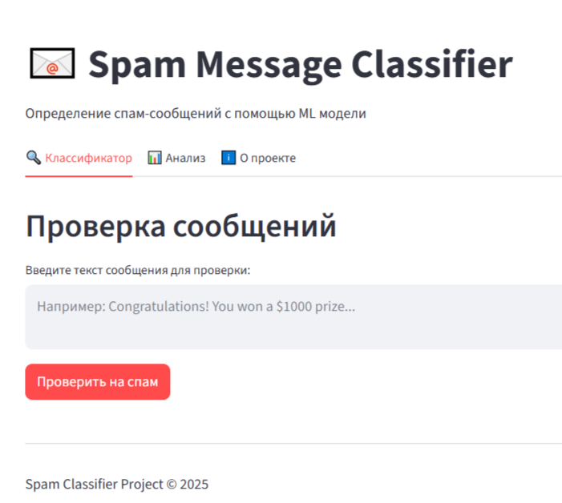
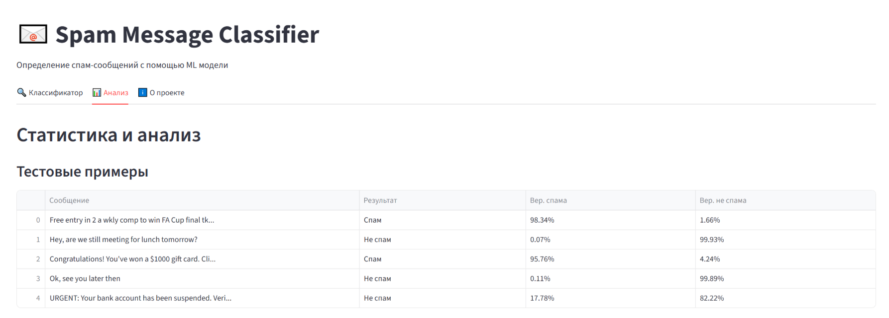

# __Spam Classification Project__

## __Проект для классификации спам-сообщений на английском языке с использованием машинного обучения, FastAPI и Streamlit.__

Многосервисное приложение для классификации спам-сообщений с использованием машинного обучения.

## Архитектура
**ML модель:** SVC для классификации спам/не спам
**Backend:** FastAPI  
**Frontend:** Streamlit с интуитивным интерфейсом  
**Контейнеризация:** Docker + Docker Compose для простого развертывания

### __Инструменты:__

- FastAPI - современный веб-фреймворк
- Streamlit - фреймворк для веб-приложений данных
- Scikit-learn - машинное обучение
- Docker - контейнеризация
- NLTK - обработка естественного языка

## Скриншоты

### Интерфейс Streamlit

<div align="center">

| Главный интерфейс | Пример предсказания тестовых примеров |
|:---:|:---:|
|  |  |
| *Ввод сообщения для классификации* | *Результаты работы модели* |

</div>

## Быстрый старт

```bash
# Запуск всех сервисов
docker-compose up --build
